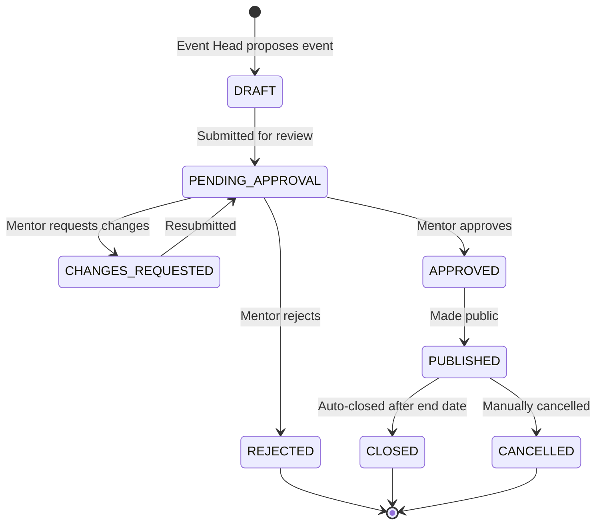
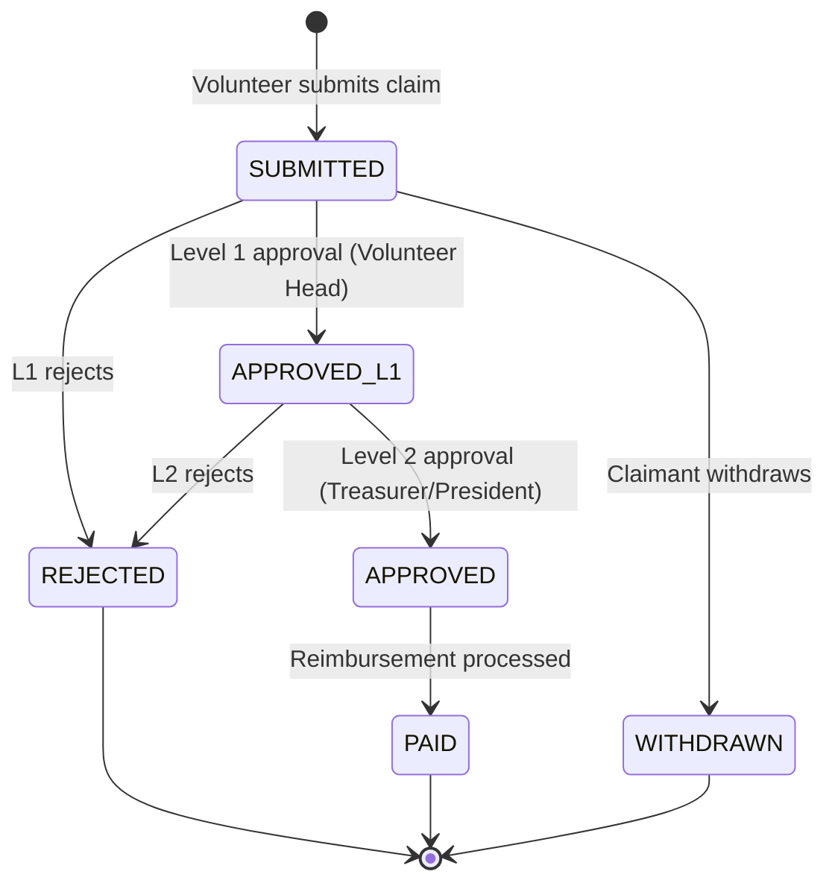
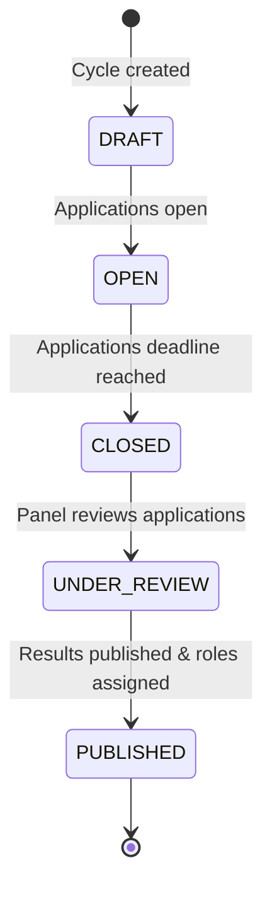

<p align="center">
  
</p>

<h1 align="center">
  🏛️ Skyline — Student Association Platform
</h1>

<p align="center">
  <strong>A full-stack, end-to-end student organisation management system</strong><br/>
  <em>Built for the Odoo x LDCE Hackathon 2026 — covering memberships, events, ticketing, merch, finance, governance, and more</em>
</p>

<p align="center">
  
  
  
  
  
  
  
  
</p>

---

## 🌟 Overview

**Skyline** is a comprehensive student association management platform that handles every facet of running a university student organisation — from membership onboarding and event management through ticketing, merchandise sales, financial accounting, volunteer coordination, leadership elections, and internal communications — all from a single, unified platform.

The system supports a **role-based hierarchy** of 12 distinct roles spanning students, members, volunteers, leadership heads, and faculty mentors. Each role has tailored access and capabilities, backed by a single robust Express 5 + PostgreSQL API.

Key highlights:

- 🎫 **Event lifecycle** — propose, review, approve, publish, sell tickets, check-in via QR, and auto-close
- 👥 **Membership engine** — tiered plans (annual/semester), online + cash payment, auto-lapse on expiry
- 🛍️ **Merch store** — product catalog with variants (size/color), SKU tracking, stock management, and order fulfilment
- 💳 **Razorpay integration** — seamless payment gateway with webhook verification and mock mode for development
- 💰 **Full financial suite** — double-entry ledger, budget allocations, expense claims with two-level approval, cash desk verification
- 📢 **Announcements & newsletter** — multi-channel (web + email) announcements, newsletter campaigns with consent tracking
- 🗳️ **Selection & governance** — leadership election cycles with application forms, interview scheduling, and automated appointments
- 🧑‍🤝‍🧑 **Volunteer & project management** — volunteer onboarding, project boards, Kanban task tracking with chat channels
- 📅 **Meetings** — agenda builder, RSVP tracking, attendance, minutes, and action items
- 🔔 **Real-time notifications** via Socket.IO
- 🔒 **Enterprise-grade security** — JWT rotation with refresh token family tracking, role-based authorization, idempotency keys, and full audit logging

---

## 🏗️ Architecture

```
OdooxLDCE/
├── frontend/                              # React 19 + Vite 8 + Tailwind CSS 4
│   ├── index.html                         # App entry point
│   ├── vite.config.js                     # Vite build configuration
│   └── src/
│       ├── App.jsx                        # React Router v7 route definitions
│       ├── main.jsx                       # React DOM render entry
│       ├── app/
│       │   └── layouts/                   # Discovery layout shell
│       ├── components/
│       │   ├── common/                    # Shared UI (ContentState, etc.)
│       │   └── ui/                        # Shadcn/Radix primitives (Button, Skeleton, etc.)
│       ├── context/                       # Auth, notification contexts
│       ├── hooks/                         # Shared React hooks
│       ├── features/
│       │   ├── auth/                      # Login, Register, Verify Email, Reset Password
│       │   ├── membership/               # Join, My Membership
│       │   ├── events/                    # Event list, detail, proposal stepper, mentor review
│       │   ├── tickets/                   # My Tickets, Ticket Pass (QR)
│       │   ├── checkin/                   # Door Scanner (QR check-in)
│       │   ├── merch/                     # Shop Catalog, Product Detail
│       │   ├── orders/                    # My Orders, Fulfilment Queue
│       │   ├── payments/                  # Checkout Status
│       │   ├── finance/                   # Ledger, Budget, Reports
│       │   ├── claims/                    # Submit Claim, Claim Queue, Claim Detail
│       │   ├── cash/                      # Cash Desk, Cash Verification Queue
│       │   ├── announcements/            # Announcement Feed, Detail, Composer
│       │   ├── newsletter/               # Newsletter Dashboard
│       │   ├── notifications/            # Notification List
│       │   ├── volunteers/               # Volunteer Home
│       │   ├── projects/                 # Project List, Kanban Board
│       │   ├── tasks/                    # Task Detail with Chat
│       │   ├── meetings/                 # Meeting List, Builder, Detail
│       │   ├── selection/                # Selection Hub, Application Form, Cycle Builder, Review
│       │   └── dashboard/               # Account Home, Manage Home
│       ├── services/                      # API service layers
│       ├── lib/                           # Utility libraries
│       ├── styles/                        # Global CSS
│       └── utils/                         # Helper functions
│
├── backend/                               # Express.js 5 REST API
│   ├── src/
│   │   ├── server.js                      # HTTP server entry point
│   │   ├── app.js                         # Express app: middleware, routes, error handling
│   │   ├── config/                        # Environment config parser
│   │   ├── db/                            # Prisma client + pg adapter
│   │   ├── lib/                           # Logger (Pino), utilities
│   │   ├── middleware/
│   │   │   ├── authenticate.js            # JWT verification + refresh token rotation
│   │   │   ├── errorHandler.js            # Global error handler
│   │   │   ├── notFound.js                # 404 handler
│   │   │   └── validate.js                # Zod schema validation
│   │   ├── modules/                       # Feature modules (17 domains)
│   │   │   ├── auth/                      # Registration, Login, Email verification, Password reset
│   │   │   ├── users/                     # User CRUD, profile management
│   │   │   ├── access/                    # Role assignments, permission management
│   │   │   ├── memberships/               # Tier management, membership lifecycle
│   │   │   ├── events/                    # Event CRUD, approval workflow, budget lines
│   │   │   ├── tickets/                   # Ticket types, reservations, QR check-in
│   │   │   ├── merch/                     # Products, variants, stock, orders
│   │   │   ├── payments/                  # Razorpay integration, webhook handler
│   │   │   ├── finance/                   # Ledger, budget, expense claims, cash collections
│   │   │   ├── approvals/                 # Price & tier change approvals
│   │   │   ├── notifications/             # In-app + Socket.IO notifications
│   │   │   ├── files/                     # File upload (Sharp image processing)
│   │   │   ├── subscribers/               # Newsletter subscribers & campaigns
│   │   │   ├── governance/                # Announcements, corrections
│   │   │   ├── volunteers/                # Volunteer registration & management
│   │   │   ├── projects/                  # Projects, tasks, chat channels
│   │   │   └── dashboards/                # KPI analytics & dashboards
│   │   ├── jobs/                          # Background jobs (reservation release, membership lapse)
│   │   └── utils/                         # Security helpers, common utilities
│   └── prisma/
│       ├── schema.prisma                  # Full data model (40+ models, 45+ enums)
│       ├── seed.js                        # Comprehensive demo data seeder (18 users, events, merch, etc.)
│       └── migrations/                    # Database migration history
│
└── package.json                           # Root workspace config (npm workspaces)
```

---

## 🔐 User Roles & Access

Skyline implements a **12-role hierarchy** with scoped permissions:

| Role | Interface | Key Capabilities |
|---|---|---|
| **Mentor** | `/manage/*` | Approve/reject event proposals, review budgets, oversee governance |
| **President** | `/manage/*` | Full platform access, approve high-value claims, manage selection cycles |
| **Treasurer** | `/manage/*` | Financial oversight, ledger management, budget allocations, claim approvals |
| **Event Head** | `/manage/*` | Propose events, manage ticket types, coordinate logistics |
| **Volunteer Head** | `/manage/*` | Manage volunteers, create projects, assign tasks |
| **Marketing Head** | `/manage/*` | Announcements, newsletter campaigns, merch management |
| **Door Volunteer** | `/door/:eventId` | QR-based event check-in |
| **Cash Desk** | `/cash-desk` | Collect cash payments, submit for verification |
| **Volunteer** | `/volunteer/*` | View assigned tasks, submit expense claims, task chat |
| **Task Assignee** | `/volunteer/*` | Scoped task execution within projects |
| **Member** | `/*` | Buy tickets at member prices, apply for leadership positions, access members-only events |
| **User** | `/*` | Browse events, buy tickets, shop merch, register as member |

---

## 🔄 Event Lifecycle



**Automated side-effects:**
- **Ticket Reservation** — 10-minute expiry window; auto-released if payment not completed
- **Merch Reservation** — 15-minute expiry window with stock rollback on timeout
- **Event Auto-Close** — Background job closes published events past their end date
- **Membership Lapse** — Expired memberships are automatically set to `LAPSED`
- **File Cleanup** — Unattached uploads are purged after 1 hour

---

## 💰 Expense Claim Workflow



---

## 🗳️ Selection (Leadership Elections) Lifecycle



---

## 🗄️ Data Model

The Prisma schema defines **40+ models** and **45+ enums** covering the full student organisation domain:

### Core & Governance

| Model | Description |
|---|---|
| `User` | Central user entity with email, password hash, avatar, disability flag |
| `RefreshToken` | JWT refresh token with family-based rotation and reuse detection |
| `EmailToken` | Email verification & password reset tokens |
| `RoleAssignment` | Scoped, time-bound role assignments with audit trail |
| `Setting` | Key-value configuration store |
| `AuditLog` | Comprehensive action audit log with before/after snapshots |
| `IdempotencyKey` | Request deduplication for critical mutations |

### Memberships & Payments

| Model | Description |
|---|---|
| `MembershipTier` | Tier definitions (Annual, Semester) with pricing and benefits |
| `Membership` | User memberships with status lifecycle and payment links |
| `CashCollection` | Cash payment records with collector, payer, and verifier |
| `Payment` | Razorpay payment records with gateway IDs and status tracking |

### Events & Ticketing

| Model | Description |
|---|---|
| `Event` | Event entity with proposal/approval workflow, budget, capacity |
| `EventBudgetLine` | Per-category budget breakdowns for events |
| `EventReview` | Mentor review decisions with comments and state snapshots |
| `TicketType` | Ticket tiers (member/non-member/all) with quota and pricing |
| `TicketReservation` | Temporary ticket holds with expiry |
| `Ticket` | Issued tickets with QR check-in support |

### Merchandise & Orders

| Model | Description |
|---|---|
| `Product` | Merch products with member/non-member pricing and status workflow |
| `ProductImage` | Ordered product images linked to file storage |
| `Variant` | Size/color variants with SKU, stock, and reservation tracking |
| `StockAdjustment` | Stock delta history with reason and actor |
| `Order` | Merch orders with payment and collection tracking |
| `OrderItem` | Line items with variant, quantity, and unit price |
| `Approval` | Price change approval requests for merch and tiers |

### Finance

| Model | Description |
|---|---|
| `LedgerEntry` | Double-entry financial records with direction, category, and source |
| `BudgetAllocation` | Period-based budget allocations from various sources |
| `BudgetLimit` | Per-category spending limits |
| `ExpenseClaim` | Volunteer expense claims with two-level approval routing |
| `ClaimReceipt` | Receipt file attachments for claims |
| `ClaimDecision` | L1/L2 approval decisions with reasons |

### Communication

| Model | Description |
|---|---|
| `Announcement` | Multi-channel announcements with scheduling and audience targeting |
| `AnnouncementCorrection` | Post-publish corrections with author attribution |
| `NewsletterSubscriber` | Subscriber records with double opt-in confirmation |
| `NewsletterConsent` | GDPR-compliant consent audit trail |
| `NewsletterCampaign` | Email campaigns with scheduling and send tracking |
| `Notification` | In-app notifications with read tracking |
| `EmailOutbox` | Queued outbound emails with retry logic |

### Volunteers & Projects

| Model | Description |
|---|---|
| `Volunteer` | Volunteer profiles with skills and availability |
| `Project` | Projects (fundraiser, event prep, other) with owner and timelines |
| `Task` | Project tasks with priority, status, and due dates |
| `TaskAssignee` | Task assignments with timestamp tracking |
| `ChatChannel` | Per-task discussion channels |
| `ChatMessage` | Task chat messages with client-side deduplication |

### Meetings

| Model | Description |
|---|---|
| `Meeting` | Meetings with audience targeting, location/link, and status |
| `AgendaItem` | Ordered agenda items with owner and duration |
| `MeetingInvite` | Invitations with required flag and RSVP tracking |
| `MeetingAttendance` | Attendance records with marker attribution |
| `MeetingMinutes` | Meeting summaries with structured decisions |
| `ActionItem` | Meeting action items linked to tasks |

### Selection & Governance

| Model | Description |
|---|---|
| `SelectionCycle` | Election cycles with application windows and status |
| `SelectionPost` | Leadership positions with seat count and eligibility rules |
| `SelectionQuestion` | Custom application questions (text, choice, multi-choice) |
| `Application` | Candidate applications with review workflow |
| `ApplicationAnswer` | Structured answers to selection questions |
| `Appointment` | Final appointments linking applications to role assignments |

### File Management

| Model | Description |
|---|---|
| `File` | Uploaded files with purpose tagging, SHA-256 checksums, and access control |

---

## 📊 Entity-Relationship Diagram

```mermaid
erDiagram
    User ||--o{ RefreshToken : "has"
    User ||--o{ EmailToken : "has"
    User ||--o{ RoleAssignment : "assigned"
    User ||--o{ Membership : "holds"
    User ||--o{ Payment : "makes"
    User ||--o{ Ticket : "owns"
    User ||--o{ Order : "places"
    User ||--o{ Notification : "receives"
    User ||--o| Volunteer : "registers as"
    User ||--o{ ExpenseClaim : "submits"
    User ||--o{ Application : "applies"
    User ||--o{ ChatMessage : "sends"
    User ||--o{ MeetingInvite : "invited to"
    User ||--o| NewsletterSubscriber : "subscribes"
    User ||--o{ File : "uploads"

    MembershipTier ||--o{ Membership : "defines"
    Membership }o--o| Payment : "paid via"
    Membership }o--o| CashCollection : "paid via"

    Event ||--o{ TicketType : "offers"
    Event ||--o{ EventBudgetLine : "has"
    Event ||--o{ EventReview : "reviewed by"
    Event ||--o{ Ticket : "admits"
    Event ||--o{ LedgerEntry : "linked to"
    Event ||--o{ Announcement : "related to"
    Event ||--o{ Project : "prepared by"

    TicketType ||--o{ TicketReservation : "reserved as"
    TicketType ||--o{ Ticket : "issued as"
    TicketReservation }o--o| Payment : "paid via"
    Ticket }o--o| Payment : "paid via"

    Product ||--o{ ProductImage : "has"
    Product ||--o{ Variant : "has"
    Variant ||--o{ StockAdjustment : "adjusted by"
    Variant ||--o{ OrderItem : "ordered as"
    Order ||--o{ OrderItem : "contains"
    Order }o--o| Payment : "paid via"

    LedgerEntry }o--o| Event : "for"
    LedgerEntry }o--o| Project : "for"

    ExpenseClaim ||--o{ ClaimReceipt : "has"
    ExpenseClaim ||--o{ ClaimDecision : "decided by"

    SelectionCycle ||--o{ SelectionPost : "has"
    SelectionPost ||--o{ SelectionQuestion : "asks"
    SelectionPost ||--o{ Application : "receives"
    Application ||--o{ ApplicationAnswer : "contains"
    Application ||--o| Appointment : "results in"
    Appointment }o--o| RoleAssignment : "creates"

    Project ||--o{ Task : "has"
    Task ||--o{ TaskAssignee : "assigned to"
    Task ||--o| ChatChannel : "has"
    ChatChannel ||--o{ ChatMessage : "contains"

    Meeting ||--o{ AgendaItem : "has"
    Meeting ||--o{ MeetingInvite : "invites"
    Meeting ||--o{ MeetingAttendance : "records"
    Meeting ||--o| MeetingMinutes : "has"
    Meeting ||--o{ ActionItem : "produces"

    Announcement ||--o{ AnnouncementCorrection : "corrected by"
    NewsletterSubscriber ||--o{ NewsletterConsent : "consents"

    File ||--o{ ProductImage : "used in"
    File ||--o{ ClaimReceipt : "attached to"
```



---

## 🚀 Quick Start

### Prerequisites

- **Node.js** ≥ 22.13.0
- **PostgreSQL** 15+
- **npm** (with workspace support)

### 1. Clone & Install

```bash
git clone https://github.com/MaitraAmbalia/OdooxLDCE.git
cd OdooxLDCE

# Install all dependencies (root + backend + frontend)
npm install
```

### 2. Environment Variables

Create a `.env` file inside `/backend`:

```env
NODE_ENV=development
PORT=4000

DATABASE_URL=postgresql://<user>:<password>@localhost:5432/student_organization

CORS_ORIGIN=http://localhost:5173
TRUST_PROXY=false
LOG_LEVEL=info
JSON_BODY_LIMIT=1mb

COLLEGE_EMAIL_DOMAIN=nirmauni.ac.in
APP_TIMEZONE=Asia/Kolkata
FILE_STORAGE_PATH=./storage

# Razorpay (optional — mock mode works without these)
RAZORPAY_KEY_ID=
RAZORPAY_KEY_SECRET=
PAYMENT_WEBHOOK_SECRET=
```

### 3. Database Setup & Seed

```bash
cd backend

# Generate Prisma client
npx prisma generate

# Push schema to database (creates all tables)
npx prisma db push

# Seed demo data (18 users, events, tickets, merch, projects, and more)
npm run seed
```

### 4. Run

```bash
# Option A: Run both from root (uses concurrently)
npm run dev

# Option B: Run individually
# Terminal 1 — Backend (port 4000)
cd backend && npm run dev

# Terminal 2 — Frontend (port 5173)
cd frontend && npm run dev
```

Open **[http://localhost:5173](http://localhost:5173)**

---

## 🧪 Demo Accounts

All seeded accounts share the same password: `Password123!`

| Role | Email | Description |
|---|---|---|
| **Mentor** | `mentor@nirmauni.ac.in` | Faculty advisor — approves events & budgets |
| **President** | `president@nirmauni.ac.in` | Full admin — manages everything |
| **Treasurer** | `treasurer@nirmauni.ac.in` | Financial oversight — ledger, claims, budgets |
| **Event Head** | `eventhead@nirmauni.ac.in` | Proposes & manages events |
| **Volunteer Head** | `volunteerhead@nirmauni.ac.in` | Manages volunteers & projects |
| **Marketing Head** | `marketinghead@nirmauni.ac.in` | Announcements & newsletter |
| **Door Volunteer** | `door@nirmauni.ac.in` | QR check-in at events |
| **Cash Desk** | `cashdesk@nirmauni.ac.in` | Cash collection & verification |
| **Volunteers** | `volunteer1@nirmauni.ac.in` | Active volunteer with tasks |
| **Member Student** | `student1@nirmauni.ac.in` | Active annual member |
| **Non-Member** | `student4@nirmauni.ac.in` | Student without membership |

---

## 📡 API Reference

All routes are prefixed with `/api/v1`. Backend runs on **port 4000**.

### Authentication

| Method | Endpoint | Description |
|---|---|---|
| `POST` | `/auth/register` | Register new user (college email required) |
| `POST` | `/auth/login` | Login → JWT access + refresh cookies |
| `POST` | `/auth/refresh` | Rotate refresh token |
| `POST` | `/auth/logout` | Revoke refresh token |
| `GET` | `/auth/me` | Get current authenticated user + roles |
| `POST` | `/auth/verify-email` | Verify email token |
| `POST` | `/auth/forgot-password` | Request password reset |
| `POST` | `/auth/reset-password` | Reset password with token |

### Users & Access

| Method | Endpoint | Description |
|---|---|---|
| `GET` | `/users` | List users (admin) |
| `GET` | `/users/:id` | Get user profile |
| `PATCH` | `/users/:id` | Update user profile |
| `GET/POST` | `/access/roles` | List / Assign roles |
| `DELETE` | `/access/roles/:id` | End role assignment |

### Memberships

| Method | Endpoint | Description |
|---|---|---|
| `GET` | `/membership-tiers` | List available tiers |
| `POST` | `/memberships/join` | Join with online payment |
| `GET` | `/memberships/me` | Get current membership status |

### Events & Ticketing

| Method | Endpoint | Description |
|---|---|---|
| `GET` | `/events` | List published events (filterable) |
| `GET` | `/events/:id` | Get event details + ticket types |
| `POST` | `/events` | Propose new event (Event Head+) |
| `PATCH` | `/events/:id` | Update event |
| `POST` | `/events/:id/reviews` | Submit mentor review |
| `POST` | `/tickets/reserve` | Reserve tickets (10-min hold) |
| `GET` | `/tickets/mine` | List user's tickets |
| `POST` | `/tickets/:id/check-in` | QR check-in at door |

### Merchandise & Orders

| Method | Endpoint | Description |
|---|---|---|
| `GET` | `/products` | List active products |
| `GET` | `/products/:id` | Get product + variants |
| `POST` | `/products` | Create product (admin) |
| `PATCH` | `/products/:id` | Update product (admin) |
| `POST` | `/orders` | Place merch order |
| `GET` | `/orders/mine` | List user's orders |
| `PATCH` | `/orders/:id/fulfil` | Mark order as ready/collected |

### Payments

| Method | Endpoint | Description |
|---|---|---|
| `POST` | `/payments/create` | Create Razorpay payment order |
| `POST` | `/payments/verify` | Verify Razorpay signature |
| `POST` | `/payments/webhook` | Razorpay webhook endpoint |
| `GET` | `/payments/:id` | Get payment status |

### Finance

| Method | Endpoint | Description |
|---|---|---|
| `GET` | `/finance/ledger` | Query ledger entries |
| `POST` | `/finance/ledger` | Record manual entry |
| `GET` | `/finance/budget` | Get budget allocations |
| `POST` | `/finance/budget` | Create budget allocation |
| `GET/POST` | `/finance/claims` | List / Submit expense claims |
| `PATCH` | `/finance/claims/:id/decide` | Approve/reject claim (L1/L2) |
| `GET/POST` | `/finance/cash` | List / Record cash collections |
| `PATCH` | `/finance/cash/:id/verify` | Verify cash collection |

### Approvals

| Method | Endpoint | Description |
|---|---|---|
| `GET` | `/approvals` | List pending approvals |
| `POST` | `/approvals/:id/decide` | Approve/reject price change |

### Volunteers & Projects

| Method | Endpoint | Description |
|---|---|---|
| `GET/POST` | `/volunteers` | List / Register volunteers |
| `PATCH` | `/volunteers/:id` | Update volunteer status |
| `GET/POST` | `/projects` | List / Create projects |
| `GET` | `/projects/:id` | Get project with tasks |
| `POST` | `/projects/:id/tasks` | Create task |
| `PATCH` | `/projects/:projectId/tasks/:id` | Update task status |

### Notifications & Files

| Method | Endpoint | Description |
|---|---|---|
| `GET` | `/notifications` | List user notifications |
| `PATCH` | `/notifications/:id/read` | Mark notification as read |
| `POST` | `/files/upload` | Upload file (Sharp processed) |
| `GET` | `/files/:id` | Download/serve file |

### Governance & Communication

| Method | Endpoint | Description |
|---|---|---|
| `GET/POST` | `/governance/announcements` | List / Create announcements |
| `PATCH` | `/governance/announcements/:id` | Update/publish announcement |
| `GET/POST` | `/governance/selection-cycles` | List / Create selection cycles |
| `POST` | `/governance/posts/:id/apply` | Submit application |
| `POST` | `/governance/applications/:id/decide` | Shortlist/appoint applicant |

### Dashboards

| Method | Endpoint | Description |
|---|---|---|
| `GET` | `/dashboards/overview` | KPI analytics (memberships, revenue, events) |
| `GET` | `/dashboards/finance` | Financial summary |

### Health

| Method | Endpoint | Description |
|---|---|---|
| `GET` | `/health` | API health check + DB connectivity |

---

## 🛠️ Tech Stack

| Layer | Technology | Version |
|---|---|---|
| **Frontend** | React | 19 |
| **Build Tool** | Vite | 8 |
| **Styling** | Tailwind CSS | 4 |
| **UI Components** | Radix UI + Shadcn | 1.x |
| **Routing** | React Router | v7 |
| **Data Fetching** | TanStack React Query | 5 |
| **Forms** | React Hook Form + Zod | 7 + 4 |
| **QR Codes** | qrcode.react + html5-qrcode | 4 + 2 |
| **Markdown** | react-markdown | 10 |
| **Toasts** | Sonner | 2 |
| **Icons** | Lucide React | 1.x |
| **Backend** | Express.js | 5 |
| **Database** | PostgreSQL | 15+ |
| **ORM** | Prisma | 6 |
| **DB Adapter** | @prisma/adapter-pg | 6 |
| **Auth** | JWT via jose (access + refresh rotation) | 6 |
| **Password Hashing** | Argon2 | 0.45 |
| **Validation** | Zod | 4 |
| **Payments** | Razorpay | — |
| **File Upload** | Multer | 2 |
| **Image Processing** | Sharp | 0.35 |
| **Logging** | Pino + pino-http | 10 + 11 |
| **Real-time** | Socket.IO | 4 |
| **Email** | Nodemailer | 10 |
| **Background Jobs** | pg-boss | 12 |
| **Object Storage** | AWS S3 (via @aws-sdk/client-s3) | 3 |
| **Security** | Helmet + CORS + Cookie-parser + JWT rotation | — |
| **Monorepo** | npm workspaces + concurrently | — |

---

## 🗄️ Database Schema Stats

| Metric | Count |
|---|---|
| **Models** | 42 |
| **Enums** | 47 |
| **Database Indexes** | 50+ (performance-optimized) |
| **Unique Constraints** | 25+ |
| **Relations** | 80+ |

---

## 🔧 Available Scripts

### Root

| Script | Command | Description |
|---|---|---|
| `dev` | `npm run dev` | Start both frontend & backend concurrently |
| `dev:frontend` | `npm run dev:frontend` | Start frontend only |
| `dev:backend` | `npm run dev:backend` | Start backend only |
| `build` | `npm run build` | Production build (frontend) |
| `start` | `npm run start` | Start production server (backend) |

### Backend

| Script | Command | Description |
|---|---|---|
| `seed` | `npm run seed` | Seed database with demo data |
| `prisma:generate` | `npm run prisma:generate` | Regenerate Prisma client |
| `prisma:migrate` | `npm run prisma:migrate` | Run database migrations |
| `prisma:studio` | `npm run prisma:studio` | Open Prisma Studio GUI |
| `lint` | `npm run lint` | Run ESLint |

---

## 📄 License

This project was built for the **Odoo x LDCE Hackathon 2026**.
